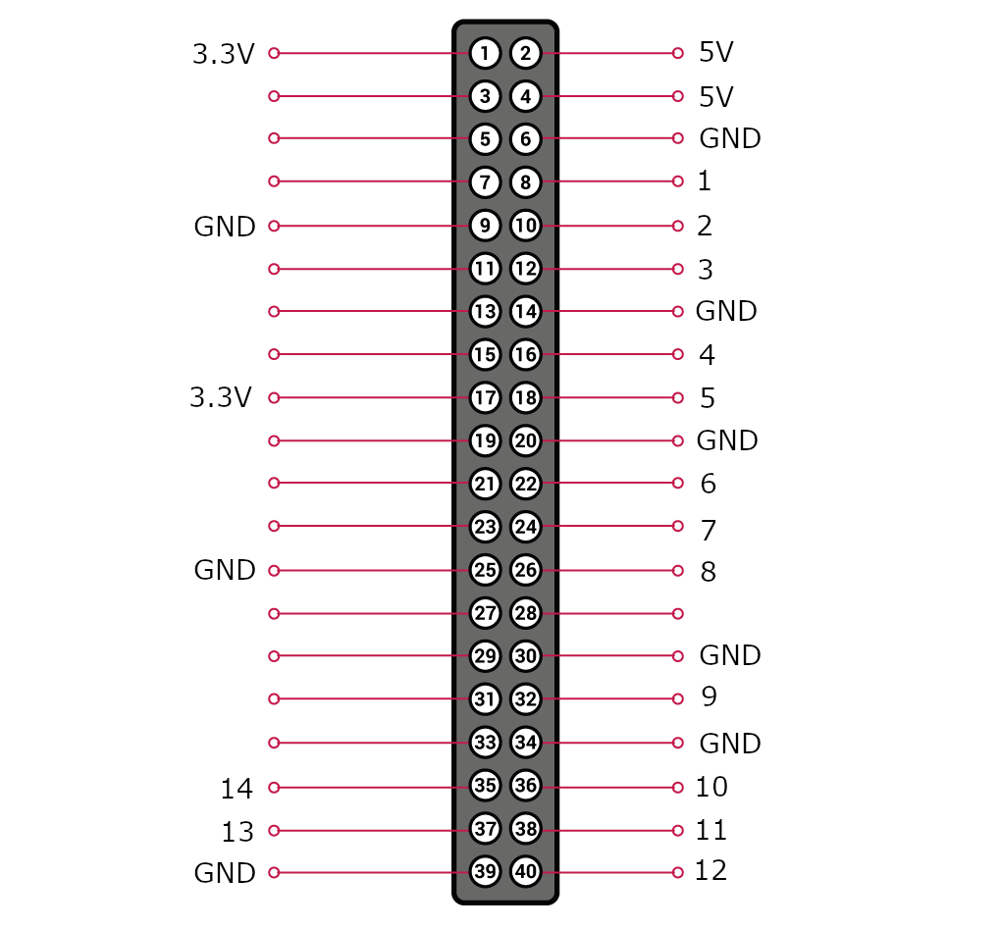

# Water Level Measurement with Raspberry Pi

This project is meant to use a Raspberry Pi (model Zero W+ up to 4B) to help measure water level in a water tank placed on the roof of a house.

## 1. Set up the Raspberry Pi

### 1.1 Install Raspberry Pi OS and configure user, network and ssh access
- Flash Raspberry Pi OS Lite/Full (32-bit) in a microSD card.
- You can follow a [headless configuration](https://www.raspberrypi.com/documentation/computers/configuration.html#setting-up-a-headless-raspberry-pi) or use the [advanced menu](https://www.raspberrypi.com/documentation/computers/getting-started.html#advanced-options) in the Raspberry Pi Imager tool to setup the user, network, and ssh.

### 1.2 Enable I2C communication in your Pi (serial sensors only)

If you are planning to use a serial sensor to read the level of your water tank, enable I2C on your Pi with the following command:

```bash 
sudo raspi-config # then, enable I2C using the UI menu
```
### 1.3 Set up a static IP addres to your Pi

Edit the `/etc/dhcpcd.conf` file as shown in [the official docs](https://www.raspberrypi.com/documentation/computers/configuration.html#static-ip-addresses) to have a static IP address.

### 1.4 Wire your sensor (discrete sensors only)

The developer's preferred wiring for a 14-bit resolution discrete sensor is detailed in the following picture:



> Note: the wiring can be overriden by the user to fit their needs.

## Integration with Alexa (optional)


## 2. Deployment

### 2.1 Prepare `level_sensor.env` file

Create a file under the name `level_sensor.env` and place the proper env vars as described below

```bash
# For discrete sensors (recommended)
WATER_SENSOR="discrete"
WATER_PINS="[14,15,18,23,24,25,8,7,12,16,20,21,26,19]" # override with your list (longer, shorter or with different GPIO pins)

# For serial sensors (to be deprecated)
WATER_SENSOR="serial"
WATER_MIN_VOLTAGE="2.0" # calibrate with your values
WATER_MAX_VOLTAGE="3.14" # calibrate with your values

# For gravity sensors (to be deprecated)
WATER_SENSOR="gravity"
WATER_MIN_REF="[-0.66, 13]" # calibrate with your values
WATER_MAX_REF="[5.6, 65]" # calibrate with your values
```

### 2.2 Prepare `level_publisher.env` file (optional, to work with Alexa)

Create a file under the name `level_publisher.env` and place the proper env vars as described below

```bash
LOCAL_SENSOR_ENDPOINT=http://localhost:8000

# All files below must be placed in a directory named "iot"
AWS_IOT_HOST="Your AWS IoT endpoint" 
AWS_IOT_TOPIC="Your AWS IoT topic"
AWS_IOT_CERT=your-certificate.pem.crt
AWS_IOT_KEY=your-private.pem.key
AWS_IOT_ROOT=YourAmazonRootCA1.pem
```

### 2.3 Install Python from source

```bash
sudo bash setup.sh [test] # optional flag to run `make test`
```

### 2.4 Deploy into your Pi

```bash
sudo deploy [reqs] # optional flag to install/upgrade Python dependencies
```

## Check the water level of your water tank

With the IP address of your Pi, enter the following URL in your browser:

```
http://{IP_ADDRESS_OF_YOUR_PI}:8080
``` 

or, `curl` the following URL via CLI
```bash
curl http://{IP_ADDRESS_OF_YOUR_PI}:8080/cli
```